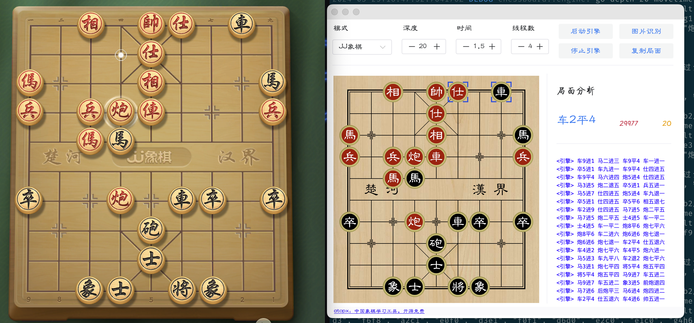
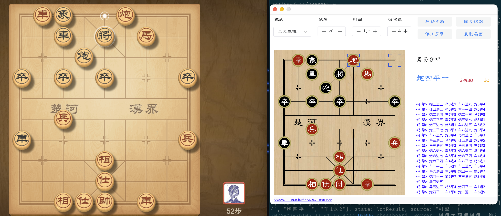

# 中国象棋学习工具

连线网络对战象棋平台，自动识别棋盘给出提示，适用于象棋爱好者和rust爱好者

集成方案：
  - 构建桌面端：tauri
  - 棋盘局面识别：卷积神经网络
  - 中国象棋引擎：pikafish

应用框架:
 - tauri

前端:
 - typescript
 - vue3
 - naive-ui

后端:
 - Rust
 - onnxruntime

TODO:
1. 增加配置窗口
2. 开局库接入
~~3. 跨平台适配~~

# 应用截图

备注: 本项目永久开源免费，禁止用于非法目的
