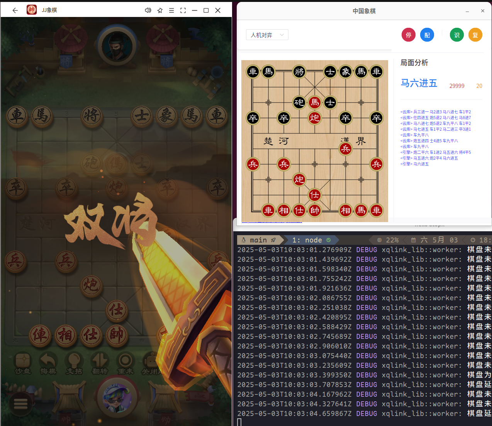

# 中国象棋学习助手 🚩

感兴趣的小伙伴请点击右上角`star`收藏

## 项目简介

“象棋学习助手”是一款智能化的中国象棋辅助工具。通过实时识别屏幕中的棋盘局面，结合高性能引擎分析，为在线对战平台的玩家提供精准走法建议与策略指导，帮助象棋爱好者快速提升棋艺水平。

## 演示视频

B站：[https://www.bilibili.com/video/BV1TQVBzuE7C?t=3.4](https://www.bilibili.com/video/BV1TQVBzuE7C?t=3.4)

## 下载安装

[点击下载](https://github.com/atopx/chessboard/releases/latest)

## ✨ 功能亮点

- ⚡ **轻量极速**  
  一键启动，无需繁琐配置，毫秒级别识别与分析，畅享零等待。  
- 🔒 **安全可靠**  
  核心模块采用 Rust 开发，确保内存安全与高并发性能。  
- 🌐 **多平台支持**  
  深度优化 Windows & macOS，同时兼容 Linux，让你随时随地稳如磐石。  
- 🚀 **GPU 智能加速**  
  原生支持 CUDA、DirectML、CoreML 等主流推理框架，全力释放显卡性能。

## 🎯 核心功能

- 📷 **实时棋盘识别**  
  基于 YOLOv8 与 ONNX Runtime，精准定位与分类棋子，自动捕捉对局状态。
- 🤖 **智能走法分析**  
  集成 Pikafish 象棋引擎，提供深度搜索与多变策略，支持分析深度和线程数自定义。  
- 🀄️ **中文招法展示**  
  将专业分析结果转为易读的中文走法描述，让开局、布局一目了然。  
- 📚 **开局库支持**  
  接入经典开局库，实时给出理论指导，助你构建坚实布局。  

## 🏗 技术架构

### 前端
- **框架**：Vue 3 + TypeScript  
- **UI 组件**：Naive UI  
- **桌面发行版**：Tauri（轻量化跨平台打包）

### 后端
- **编程语言**：Rust  
- **棋盘识别**：YOLOv8 + ONNX Runtime  
- **象棋引擎**：Pikafish（高性能中国象棋引擎）  
- **应用通信**：Tauri API

## 🚀 快速上手

1. 下载并运行程序
2. 在弹窗中选择目标窗口
3. 工具将自动识别棋盘并启动引擎分析
4. 右侧面板实时展示最佳走法与评分
5. 可在“设置”中自由调整分析深度、线程数及开局库参数

## 📸 应用截图

  
  

##### Linux

## 🛠 开发计划

- [x] 基础棋盘识别
- [x] 引擎分析集成
- [x] 跨平台适配
- [x] 可视化配置界面
- [ ] 自研轻量AI引擎接入
- [ ] 更多引擎配置项
- [ ] 开局库接入
- [ ] 对局数据导出
- [ ] 个性化学习数据统计 
- [ ] 人机对战模式

## 📜 许可声明

1. 本项目基于 Apache-2.0 许可证（[LICENSE](./LICENSE)），永久免费开源，仅供学习与研究使用。
2. 严禁任何商业化或非法用途。
3. 使用本工具时，请遵守各平台用户协议，本工具不涉及任何破解或自动化操作。
